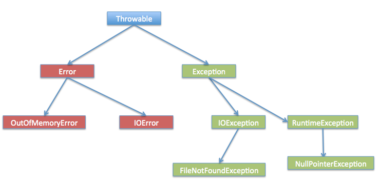
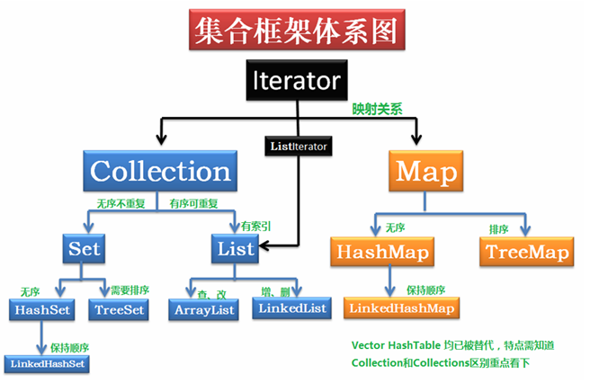

在 Java 中，异常分为两种主要类型：检查异常（Checked Exception）和非检查异常（Unchecked Exception）。

1. **检查异常（Checked Exception）**：
    - 检查异常是在编译时由编译器强制检查的异常。这些异常在编写代码时必须显式地捕获或者在方法的声明中抛出（使用 `throws` 关键字）。
    - 检查异常是 `Exception` 类及其子类中除了 `RuntimeException` 及其子类之外的所有异常，例如 `IOException`、`SQLException` 等。
    - 检查异常通常表示程序在运行时可能遇到的外部错误或者异常情况，需要程序员在编写代码时处理或者传播这些异常，以确保程序的健壮性和稳定性。

2. **非检查异常（Unchecked Exception）**：
    - 非检查异常是在运行时抛出的异常，在编译时不会强制检查。程序员可以选择捕获或者不捕获这些异常，但不会受到编译器的干扰。
    - 非检查异常通常是 `RuntimeException` 类及其子类的异常，如 `NullPointerException`、`ArrayIndexOutOfBoundsException` 等。
    - 非检查异常通常表示程序中的逻辑错误或者编程错误，例如空指针引用、数组越界等。这些异常通常由程序员在代码中修复，而不是通过捕获和处理异常来处理。

在实际编码中，通常建议将程序中可能出现的外部异常（如文件读取、网络通信等）声明为检查异常，并在合适的地方捕获或者传播这些异常。而对于程序中的逻辑错误或者编程错误，通常会导致非检查异常抛出，程序员应该在代码中修复这些问题，以避免异常的发生。

>https://www.cnblogs.com/jing99/p/7057245.html